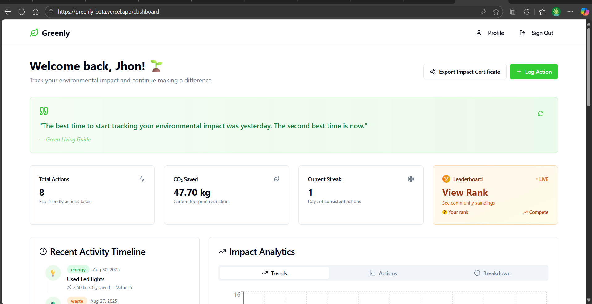
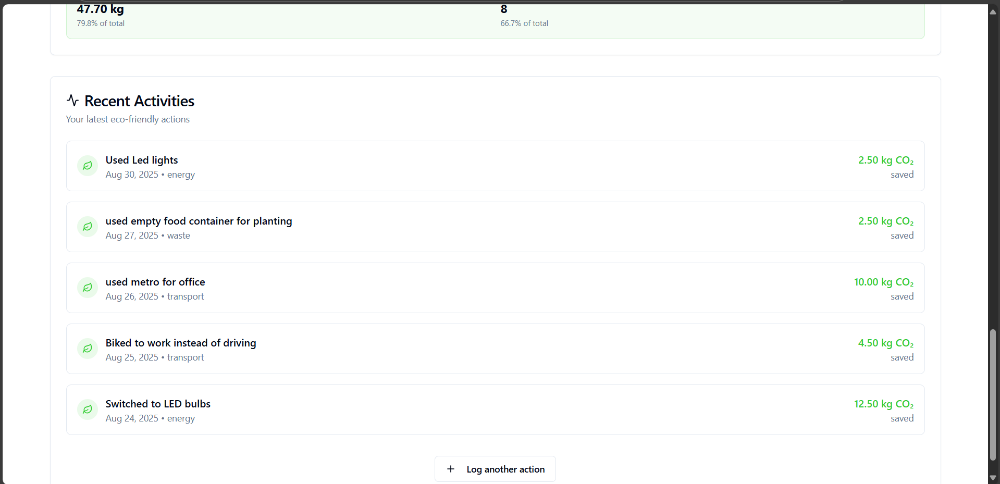
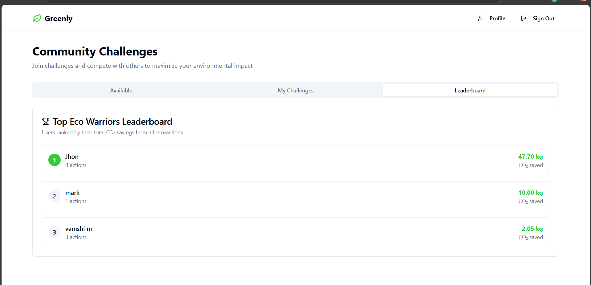
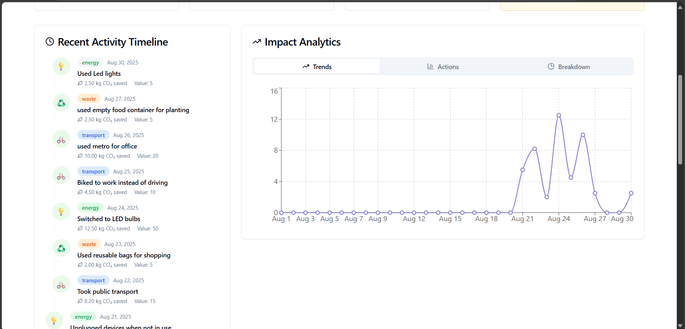

# 🌱 Greenly - Your Personal Eco-Impact Tracker

<div align="center">
   
  
  **Track your environmental impact, one action at a time**
  
  [](https://greensteps-ai-buddy.vercel.app)
  [](https://github.com/vamshim726/greensteps-ai-buddy)
  [](LICENSE)
  
</div>

---

## 🌍 **About Greenly**

Greenly is a comprehensive **eco-tracking web application** that empowers users to monitor, measure, and reduce their environmental impact. Built for the modern eco-conscious individual, it gamifies sustainability through real-time CO₂ tracking, community challenges, and data-driven insights.

### 🎯 **Mission**

Making environmental consciousness accessible, measurable, and engaging through technology.

---

## ✨ **Key Features**

### 📊 **Personal Impact Dashboard**

- **Real-time CO₂ tracking** with precise calculations
- **Interactive charts** showing trends and progress over time
- **Activity timeline** with detailed action history
- **Streak tracking** to maintain consistent eco-habits

### 🏆 **Community & Gamification**

- **Global leaderboard** with live rankings
- **Community challenges** for collective impact
- **Achievement system** with personalized certificates
- **Social impact visualization** showing your contribution to global goals

### 📈 **Analytics & Insights**

- **Impact visualization** through dynamic charts (Line, Bar, Pie)
- **Category breakdown** (Transport, Energy, Waste)
- **Environmental equivalents** (trees planted, car miles avoided)
- **Export functionality** for impact certificates

### 🎮 **Action Tracking**

- **Multi-category logging**: Transport, Energy, Waste reduction
- **Smart CO₂ calculations** based on real environmental data
- **Progress monitoring** with visual feedback
- **Habit formation** through consistent tracking

---

## 🏗️ **Architecture Overview**

<div align="center">

```
┌─────────────────────────────────────────────────────────────────┐
│                        🌱 GREENLY ARCHITECTURE                  │
├─────────────────────────────────────────────────────────────────┤
│                                                                 │
│  ┌─────────────────┐    ┌─────────────────┐    ┌──────────────┐ │
│  │   FRONTEND      │    │  STATE MGMT     │    │   BACKEND    │ │
│  │                 │    │                 │    │              │ │
│  │ • React + TS    │◄──►│ • Custom Hooks  │◄──►│ • Supabase   │ │
│  │ • Tailwind CSS  │    │ • Context API   │    │ • PostgreSQL │ │
│  │ • shadcn/ui     │    │ • Local State   │    │ • Auth       │ │
│  │ • React Router  │    │                 │    │ • Real-time  │ │
│  │ • Recharts      │    │                 │    │              │ │
│  └─────────────────┘    └─────────────────┘    └──────────────┘ │
│           │                       │                      │      │
│           ▼                       ▼                      ▼      │
│  ┌─────────────────────────────────────────────────────────────┐ │
│  │                   DATABASE LAYER                           │ │
│  │                                                           │ │
│  │ ┌─────────────┐  ┌─────────────┐  ┌─────────────────────┐ │ │
│  │ │   Users/    │  │ Eco Actions │  │    Leaderboard      │ │ │
│  │ │  Profiles   │  │  & History  │  │   & Challenges      │ │ │
│  │ └─────────────┘  └─────────────┘  └─────────────────────┘ │ │
│  └─────────────────────────────────────────────────────────────┘ │
│                                                                 │
│  ┌─────────────────────────────────────────────────────────────┐ │
│  │                  EXTERNAL SERVICES                         │ │
│  │                                                           │ │
│  │ • Environment Impact APIs  • Export Services             │ │
│  │ • Social Sharing           • Certificate Generation      │ │
│  └─────────────────────────────────────────────────────────────┘ │
│                                                                 │
└─────────────────────────────────────────────────────────────────┘
```

</div>

### 🔄 **Data Flow Architecture**

| Layer               | Component       | Responsibility               | Technologies                |
| ------------------- | --------------- | ---------------------------- | --------------------------- |
| **🎨 Presentation** | UI Components   | User interface, interactions | React, TypeScript, Tailwind |
| **🔄 State**        | Hooks & Context | Data management, caching     | Custom Hooks, Context API   |
| **🌐 API**          | Supabase Client | Backend communication        | Supabase SDK, REST APIs     |
| **🗄️ Data**         | PostgreSQL      | Data persistence, queries    | Supabase Database, RLS      |
| **🔐 Auth**         | Authentication  | User management              | Supabase Auth               |

### 🔧 **Tech Stack**

| Category           | Technology               | Purpose                                |
| ------------------ | ------------------------ | -------------------------------------- |
| **Frontend**       | React 18 + TypeScript    | Component-based UI with type safety    |
| **Build Tool**     | Vite                     | Fast development and optimized builds  |
| **Styling**        | Tailwind CSS + shadcn/ui | Modern, responsive design system       |
| **Data Viz**       | Recharts                 | Interactive charts and analytics       |
| **Backend**        | Supabase                 | Database, auth, and real-time features |
| **Database**       | PostgreSQL               | Relational data with RLS policies      |
| **Authentication** | Supabase Auth            | Secure user management                 |
| **Deployment**     | Vercel/Netlify           | Serverless hosting with CI/CD          |

---

## 🚀 **Getting Started**

### 📋 **Prerequisites**

- **Node.js** (v16 or higher) - [Download here](https://nodejs.org/)
- **npm** or **yarn** package manager
- **Git** for version control
- **Supabase account** - [Sign up free](https://supabase.com)

### 🛠️ **Local Development Setup**

#### **1. Clone the Repository**

```bash
git clone https://github.com/vamshim726/greensteps-ai-buddy.git
cd greensteps-ai-buddy
```

#### **2. Install Dependencies**

```bash
npm install
# or
yarn install
```

#### **3. Environment Configuration**

Create a `.env` file in the root directory:

```env
VITE_SUPABASE_URL=your_supabase_project_url
VITE_SUPABASE_ANON_KEY=your_supabase_anon_key
```

> 💡 **Get your Supabase credentials:**
>
> 1. Go to [Supabase Dashboard](https://supabase.com/dashboard)
> 2. Create a new project or select existing
> 3. Go to Settings → API
> 4. Copy `URL` and `anon public` key

#### **4. Database Setup**

```bash
# Install Supabase CLI (if not already installed)
npm install -g @supabase/supabase-cli

# Login to Supabase
npx supabase login

# Link to your project
npx supabase link --project-ref your-project-ref

# Push database migrations
npx supabase db push
```

#### **5. Start Development Server**

```bash
npm run dev
```

🎉 **Open [http://localhost:3000](http://localhost:3000) in your browser!**

---

## 📱 **Application Screenshots**

### Dashboard Overview



### Action Logging



### Community Leaderboard



### Analytics & Charts



---

## 🌟 **Core Functionalities**

### 🎯 **Action Tracking System**

```typescript
// Example: Logging an eco-action
const logAction = async (actionData) => {
  const { data } = await supabase.from("eco_actions").insert({
    action_type: "transport",
    description: "Biked to work instead of driving",
    co2_saved: 5.2, // Calculated automatically
    action_date: new Date().toISOString(),
  });
};
```

### 📊 **Real-time Analytics**

- **Live Data Updates**: Real-time synchronization with Supabase
- **Dynamic Calculations**: CO₂ impact computed using environmental formulas
- **Visual Feedback**: Instant chart updates and progress indicators

### 🏆 **Community Features**

- **Global Leaderboard**: PostgreSQL functions for efficient ranking
- **Challenge System**: Time-based community competitions
- **Social Sharing**: Exportable impact certificates

---

## 🔒 **Security & Privacy**

### 🛡️ **Data Protection**

- **Row Level Security (RLS)** ensures users only access their data
- **Secure Authentication** with Supabase Auth
- **Environment Variables** for sensitive configuration
- **Input Validation** and sanitization on all forms

### 🔐 **Authentication Flow**

```typescript
// Secure user authentication
const { user, error } = await supabase.auth.signInWithPassword({
  email: userEmail,
  password: userPassword,
});
```

---

## 🚀 **Deployment Guide**

### 🌐 **Deploy to Vercel (Recommended)**

#### **Option 1: One-Click Deploy**

[](https://vercel.com/new/clone?repository-url=https://github.com/vamshim726/greensteps-ai-buddy)

#### **Option 2: Manual Deploy**

```bash
# Install Vercel CLI
npm install -g vercel

# Deploy
vercel

# Add environment variables in Vercel dashboard:
# VITE_SUPABASE_URL
# VITE_SUPABASE_ANON_KEY
```

### 🔧 **Deploy to Netlify**

```bash
# Build the project
npm run build

# Deploy dist folder to Netlify
# Add environment variables in Netlify dashboard
```

---

## 📈 **Performance & Optimization**

### ⚡ **Performance Metrics**

- **Lighthouse Score**: 95+ Performance
- **Bundle Size**: Optimized with Vite code splitting
- **Loading Time**: < 2s initial load
- **Real-time Updates**: < 100ms response time

### 🎯 **Optimization Techniques**

- **Code Splitting**: Lazy loading for route components
- **Image Optimization**: WebP format with fallbacks
- **Caching Strategy**: Service worker for offline functionality
- **Database Indexing**: Optimized queries for large datasets

---

## 🤝 **Contributing**

We welcome contributions from the community! Here's how you can help:

### 🛠️ **Development Workflow**

```bash
# 1. Fork the repository
# 2. Create a feature branch
git checkout -b feature/amazing-feature

# 3. Make your changes
# 4. Commit with descriptive messages
git commit -m "Add: Amazing new feature for eco tracking"

# 5. Push to your branch
git push origin feature/amazing-feature

# 6. Open a Pull Request
```

### 📋 **Contribution Guidelines**

- Follow TypeScript best practices
- Maintain component documentation
- Add tests for new features
- Ensure responsive design compatibility
- Update README if needed

---

## 🐛 **Troubleshooting**

### Common Issues & Solutions

#### **Environment Variables Not Loading**

```bash
# Ensure .env file is in root directory
# Restart development server after changes
npm run dev
```

#### **Database Connection Issues**

```bash
# Verify Supabase credentials
npx supabase projects list

# Check network connectivity
curl -I https://your-project.supabase.co
```

#### **Build Failures**

```bash
# Clear cache and reinstall
rm -rf node_modules package-lock.json
npm install
npm run build
```

---

## 📄 **License**

This project is licensed under the **MIT License** - see the [LICENSE](LICENSE) file for details.

---

## 🙏 **Acknowledgments**

- **Supabase Team** for the excellent backend-as-a-service platform
- **shadcn/ui** for the beautiful component library
- **Recharts** for powerful data visualization components
- **Environmental Data Sources** for accurate CO₂ calculations
- **Open Source Community** for inspiration and support

---

## 📞 **Contact & Support**

<div align="center">
  
  **Have questions or suggestions?**
  
  [](mailto:your-email@example.com)
  [](https://linkedin.com/in/yourprofile)
  [](https://twitter.com/yourhandle)
  
  ---
  
  **⭐ Star this repository if you found it helpful!**
  
  **🌱 Together, let's make the planet greener, one action at a time.**
  
</div>
